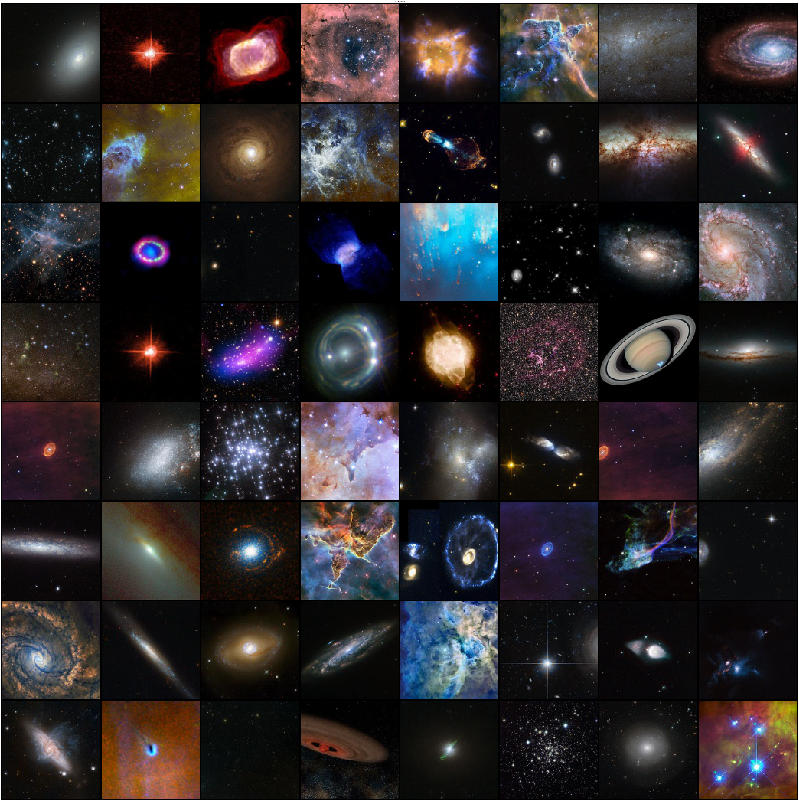

# GANs generating images from space

For now, I am using DCGANs for images generation, which are quite old. I plan to try out new architectures very soon !

Images are quite low resolution (128x128) since I am using my laptop's GPU for now.

## Generated images

## Original images

## Data

The dataset used is made of pictures of the Hubble telescope scrapped from hubblesite.org and augmented (crop, rotation, color variations). I took ~1000 of the best pictures, which gave me about 8000 images after augmentation.